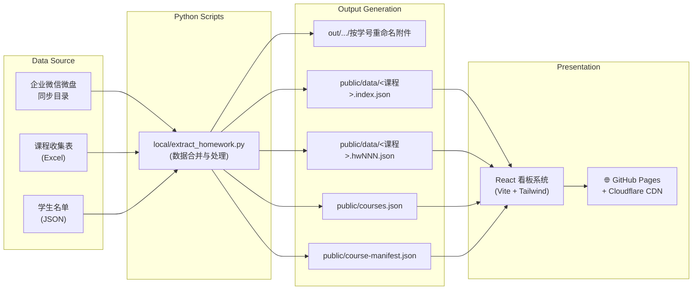

# WeCom Homework Auto Tracker

<div align="center">

[](https://python.org)
[](https://react.dev)
[](https://vitejs.dev)
[](https://tailwindcss.com)
[](https://www.typescriptlang.org/)
[](LICENSE)

**企业微信微盘作业收集的自动化解决方案：本地同步文件 → 一键提取统计 → 课程看板在线发布**

[在线看板体验](https://homework.hicancan.top) · [逆向分析文档](doc/wedrive_reverse_engineering.md) · [提交 Issue](#-contributing)

</div>

---

## 📖 Why This Project / 为什么做这个项目

课程作业管理里最耗时、最容易出错的部分通常不是“看结果”，而是繁琐的收集和统计过程：

- ❌ 收集表记录与微盘附件不一致，人工比对非常缓慢且容易出错。
- ❌ 一门课多个班级、多次作业并行推进，容易误操作全量执行，导致历史数据被覆盖。
- ❌ 网页看板缓存命中导致更新不及时：“我明明更新了，学生为什么还看不到？”
- ❌ 公网展示成绩和作业完成情况时，如何兼顾 **透明度** 与 **隐私保护**？

针对以上痛点，本项目的核心目标是：**把这些高频、琐碎、易错的人工操作收敛成可重复、可审计、可分享的标准自动化流程。**

## ✨ Key Features / 核心特性

- **🛡️ 强制区间运行**：执行脚本必须填入 `--from` 和 `--to` 参数，从源头杜绝因全量执行而覆盖历史数据的误操作。
- **📦 增量冻结策略**：区间外的历史统计数据永久保留，区间内如果有缺失的作业，随时支持回退恢复到历史数据。
- **⚡ 超快的前端响应**：作业数据按次分片存储在单独的 JSON 中（`course.index` + `hwNNN`），前端按需懒加载，极速渲染。
- **🔄 稳定实时更新**：前端拉取配置时强制设定 `no-store`，搭配数据文件版本参数 `?v=...`，确保学生永远看到**最准确**的数据，无需烦心浏览器缓存刺客。
- **🧑‍🎓 “其他”学生通道**：除了常规名单，内置支持 `other_students.json`（可用于重修、补修学生），名单结构独立展示，互不干扰。
- **🔒 隐私优先设计**：看板展示全部使用**学号及班级信息**进行脱敏，完全不会暴露个人真实姓名。
- **🌐 零成本自动部署**：基于 GitHub Actions 和 GitHub Pages 实现自动构建与发布，搭配 Cloudflare 支持全站缓存精准清理。

## 🏗️ System Architecture / 系统架构

整个数据流从**企业微信本地同步**开始，经过提取与处理，最终上云呈现：



## 🚀 Quick Start / 快速上手 (Windows / PowerShell)

### 1️⃣ 环境准备

克隆代码并配置 Python 虚拟环境：

```powershell
git clone https://github.com/hicancan/wecom-homework-auto-tracker.git
cd wecom-homework-auto-tracker

# 初始化 Python 虚拟环境
python -m venv .venv
.\.venv\Scripts\Activate.ps1

# 安装依赖项
pip install pandas openpyxl requests
```

### 2️⃣ 准备本地配置文件

将提供的配置模板复制一份到本地目录：

```powershell
Copy-Item .\config\config.template.json .\config\local.config.json
```

编辑 `config/local.config.json`，根据你的本地环境设置相关路径：

- `courses_dir`: 课程 Excel 所在目录
- `attachments_root`: 企业微信微盘同步根目录
- `students`: 基础学生名单 JSON（见下方格式示例）
- `other_students`: 其他学生名单 JSON（可保留默认）
- `out_root`: 提取附件和数据的输出根目录
- `web_data_root`: 网页数据目录（推荐保持默认 `webapp/public/data`）
- `course_index`: 课程总索引文件路径（推荐保持默认 `webapp/public/courses.json`）

> **`students` 名单数据格式示例：**
> ```json
> [
>   { "班级": "B240401", "学号": "B24040101", "姓名": "张三" },
>   { "班级": "B240402", "学号": "B24040201", "姓名": "李四" }
> ]
> ```

### 3️⃣ 运行数据提取 (推荐使用交互式脚本)

我们提供了一个友好的交互式脚本，协助你轻松提取指定轮次的作业数据：

```powershell
pwsh -File .\scripts\run_extract_interactive.ps1
```

**交互式脚本将带你完成：**
1. 自动列出所有支持的课程 Excel。
2. 让你轻松勾选一个或多个课程（支持输入 `1,2` / `1，2` / `1-3` / `all`）。
3. 循环让你输入需要处理的作业批次区间 (`--from` 和 `--to`)。
4. 在正式执行前展示参数总览，供你做最后确认。

<details>
<summary>💡 如果你想使用纯命令行执行（Direct CLI），点击这里展开：</summary>

```powershell
python .\local\extract_homework.py `
  --excel ".\config\算法分析与设计B240401-03.xlsx" `
  --from 1 `
  --to 2
```

**重要约束：**
考虑到安全问题，`--from` 和 `--to` 是**必填项**，如果你未显式传入，脚本会抛出异常报错退出，防止直接执行全量提取操作导致线上数据覆盖错误。
</details>

### 4️⃣ 本地预览 Web 看板

```powershell
cd .\webapp
npm ci
npm run dev
```
打开控制台提示的本地链接，即可预览最新的统计看板！

### 5️⃣ 构建与部署 (GitHub Actions)

当你提取完毕并确认网页效果后，通过传统的 Git 工作流将其推送到云端：

```powershell
cd .\webapp
npm run build

cd ..
git add webapp/public webapp/src local scripts .github/workflows/pages.yml README.md
git commit -m "feat(data): update homework stats for round 1-3"
git push origin main
```
`main` 分支发生变动后，代码仓库的 GitHub Actions 将自动接管流程，帮你部署静态资源到 GitHub Pages。

---

## 📚 Data Model & Cache Strategy / 数据流与缓存策略

### 前端三层索引架构
前端摒弃了全量拉取单一大 JSON 文件的笨重设计，采用了精妙的三层数据拉取方案：

1. `course-manifest.json` (记录最新资源的哈希版本)
2. `courses.json` (课程总入口)
3. `data/<course>.index.json` (指定课程的概览)
4. `data/<course>.hwNNN.json` (该课程第 N 次作业的详情数据)

**带来的优势：**
- 仅仅加载当前课程、当前作业涉及的数据，极大缩小首屏体积。
- 哪怕该门课程长期运行录入了 100 次作业，首屏加载和界面切换的体验始终疾速拉满。

### 缓存失效策略
我们没有粗暴地设置全局 `no-store`，而是选择了更为兼顾性能的动态组合策略：
- **Manifest 必须最新**：入口控制文件 `course-manifest.json` 前端会加上 `cache: 'no-store'` 和 `?t=Date.now()` 请求最新的指纹。
- **其他 JSON 永久缓存**：其他带版本号的 JSON 通过 `?v=<manifest.version>` 取用 CDN 中缓存版本，强隔离新老版本带来的脏数据。
- 配合 Cloudflare 提供的 `purge_everything` 工作流能力，达到发布即生效。（如果在 Secrets 里配置了相应的密钥）

---

## 💡 Operational Best Practices / 运营最佳实践

1. **分批小步快跑（推荐的回收方式）**
   如果一天内收取多轮作业，**请不要每次跑全量提取**。我们更推荐：
   - 第一轮：`--from 1 --to 1`
   - 第二轮：`--from 1 --to 2`
   - 第三轮：`--from 1 --to 3`
   这样既保证了连续的增量，又避免污染未来未发布数据的轮次。

2. **微盘存储空间优化**
   当企业微信微盘空间即将拉满时，**勇敢清理并删除历史的原始附件**。只要你的 Git 仓库和本地 `webapp/public/data/*.hwNNN.json` 文件妥善保管着已生成的 JSON，在线的看版依旧坚不可摧地能查询到历史的情况。

3. **班级跨度大的范围锁定 (Class scope locking)**
   如果在 `courses.json` 中配置了 `course_classes.<课程名>.lock = true`，这门课统计的班级范围将被固定，不会再被新拉取的 Excel 数据自动探测和调整范围。这在处理包含学长/补修混杂的跨学期班级时，数据表现会非常稳定。

---

## 🔒 Security & Compliance / 隐私与合规

作为处理学生信息的工具，本项目高度关注信息保护：
- **脱敏显示**：看版前端仅展示**学号**，不在公网泄漏名字等敏感识别信息。
- **本地分离设计**：核心提取脚本仅在本地获取数据并运行，**不直接托管接管企业微信的登录态或 Token**。本地读取只基于企业官方微盘客户端完成。
- 对登录风控和授权问题做了彻底解耦：企业端的登录与风控制度交给官方客户端；二次统计处理留给本项目的脚本系统，合规且稳定。详情背景请参阅文档：[微盘逆向分析方案文档](doc/wedrive_reverse_engineering.md)。

---

## 🛠️ Troubleshooting / 常见问题排查

- **Q: 提示我课程选择输入报错？**
  A: 输入的格式须遵循如下规范：英文逗号、中文逗号分隔 `1,2` `1，2`，区间 `1-3` 或者是直接敲入 `all`。
- **Q: 它骂我：“缺少 `--from` 和 `--to` 参数！”**
  A: 别慌，这是我们精心设计的全量覆盖保护机制。请补齐具体的开始与截止次数即可正常执行。
- **Q: 学生明确表示交了，为何我的附件还是没统计进去？**
  A: 首先检查你的微盘本地同步客户端是否完成同步（有时会在几十兆左右卡顿）；其次检查文件名是否被手动擅自更改、重命名使其不符合正则表达式规则。
- **Q: 推上去后，网页仍然显示老数据？**
  A: 用浏览器的隐身模式测试下。如果隐身模式也还是旧的，确认下 GitHub Actions Pipeline 有没有执行通过，`course-manifest.json` 在代码库里有没有发生更新。

---

## 🤝 Contributing / 参与贡献

欢迎大家各抒己见提出 Issue 与 PR，一起完善这套工作流！
强烈推荐在发起代码合并请求之前，执行一遍前端的完整构建，以确保没有任何编译期的错误：

```powershell
cd .\webapp
npm run build
```

## 📄 License / 协议许可

本项目采用 [MIT](LICENSE) 许可协议开源。

<p align="center">
  <i>If this project helped you, please consider giving it a ⭐!</i>
</p>
